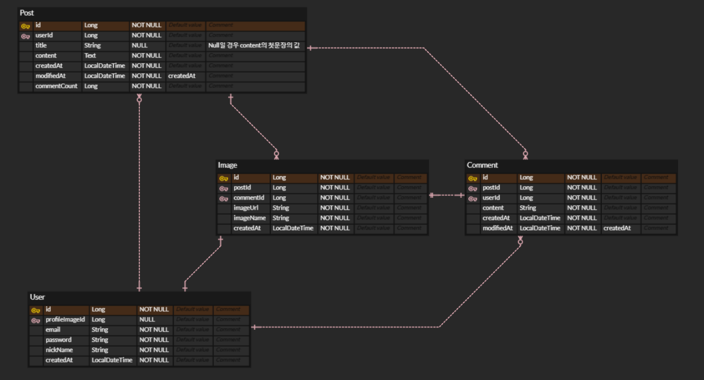

## ER digaram:



## 프로젝트 디렉토리 구조
도메인 중심 설계를 기반으로 구성하였습니다.
```
├─domain
│  ├─comment
│  │  ├─controller
│  │  ├─domain
│  │  ├─dto
│  │  ├─exception
│  │  ├─repository
│  │  └─service
│  ├─image
│  │  ├─controller
│  │  ├─domain
│  │  ├─dto
│  │  ├─exception
│  │  ├─repository
│  │  └─service
│  ├─post
│  │  ├─controller
│  │  ├─domain
│  │  ├─dto
│  │  ├─exception
│  │  ├─repository
│  │  └─service
│  └─user
│      ├─controller
│      ├─domain
│      ├─dto
│      ├─exception
│      ├─repository
│      └─service
└─global
├─auth
├─common
│  ├─entity
│  └─exception
└─config
```
